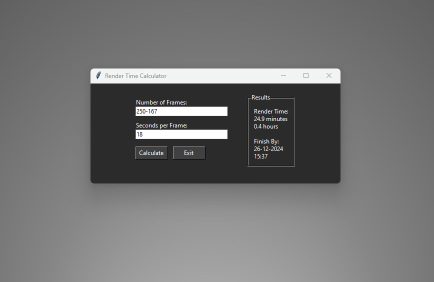

# Render Time Calculator

A desktop application built with Python and Tkinter that helps 3D artists estimate completion times for Blender rendering projects. Features a dark theme UI and precise time calculations.

 <!-- You can add this later -->

## Features

- Calculate total render time based on frame count and per-frame render time
- Support for mathematical expressions in frame input (e.g., "260-200")
- Dark theme UI for reduced eye strain
- Precise completion time estimation
- Error handling for invalid inputs
- Cross-platform compatibility (Windows, Linux, MacOS)

## Installation

### Option 1: Running from Source

1. Clone this repository:
```bash
git clone https://github.com/yourusername/render-time-calculator.git
cd render-time-calculator
```

2. Install requirements:
```bash
pip install -r requirements.txt
```

3. Run the application:
```bash
python render_calculator.py
```

### Option 2: Windows Executable

#### Download Pre-built Executable
Download the latest release from the [Releases](https://github.com/yourusername/render-time-calculator/releases) page.

#### Build Your Own Executable
If you'd like to build the executable yourself:

1. Make sure you have PyInstaller installed:
   ```bash
   pip install pyinstaller
   ```

2. Ensure your file structure looks like this:
   ```
   your-folder/
   ├── render_calculator.py
   └── render_calculator.ico
   ```

3. Run the PyInstaller command:
   ```bash
   pyinstaller --onefile --windowed --icon=render_calculator.ico render_calculator.py
   ```

4. Find your executable in the newly created `dist` folder

The `--onefile` flag creates a single executable file, and `--windowed` prevents a console window from appearing when running the program. The icon file needs to be in the same folder as the script when building.

## Usage

1. Enter the number of frames to render (can use mathematical expressions like "300-100")
2. Enter the render time per frame in seconds
3. Click "Calculate" or press Enter
4. View the estimated total render time and completion time

## Technical Details

- Built with Python 3.x and Tkinter/ttk
- Features a custom dark theme
- Handles timezone calculations for accurate completion time estimates
- Input validation and error handling for robustness

## Contributing

Feel free to open issues or submit pull requests if you have suggestions for improvements.

## License

This project is licensed under the MIT License - see the [LICENSE](LICENSE) file for details.

## Source Code

Here's the full source code of the calculator for easy reference:

```python
import tkinter as tk
from tkinter import ttk
from datetime import datetime, timedelta


class RenderCalculator(tk.Frame):
   def __init__(self, master=None):
       super().__init__(master)
       self.master = master
       # Set minimum window size
       self.master.minsize(500, 200)
       # Configure dark theme colors
       self.master.configure(bg='#2b2b2b')
       self.configure(bg='#2b2b2b')

       # Configure the style
       self.style = ttk.Style()
       self.style.theme_use('default')  # Reset to default theme first

       # Configure styles with explicit colors
       self.style.configure('Dark.TFrame', background='#2b2b2b')
       self.style.configure('Dark.TLabel',
                            background='#2b2b2b',
                            foreground='#ffffff')
       self.style.configure('Dark.TButton',
                            background='#404040',
                            relief='raised')
       self.style.configure('Dark.TLabelframe',
                            background='#2b2b2b')
       self.style.configure('Dark.TLabelframe.Label',
                            background='#2b2b2b',
                            foreground='#ffffff')
       self.style.configure('Dark.TEntry',
                            fieldbackground='#ffffff',
                            foreground='black')

       # Map states to colors for buttons
       self.style.map('Dark.TButton',
                      background=[('active', '#505050')],
                      foreground=[('active', 'white'), ('!active', 'white')])

       self.create_widgets()


   def create_widgets(self):
       # Create main container frames
       left_frame = ttk.Frame(self, style='Dark.TFrame')
       left_frame.pack(side='left', padx=20, pady=10)

       right_frame = ttk.Frame(self, style='Dark.TFrame')
       right_frame.pack(side='left', padx=20, pady=10)

       # Left frame contents (inputs)
       frames_label = ttk.Label(left_frame, text="Number of Frames:", style='Dark.TLabel')
       frames_label.pack(anchor='w')
       self.frames_input = ttk.Entry(left_frame, width=30, style='Dark.TEntry')
       self.frames_input.pack(anchor='w', pady=(0, 10))

       seconds_label = ttk.Label(left_frame, text="Seconds per Frame:", style='Dark.TLabel')
       seconds_label.pack(anchor='w')
       self.seconds_input = ttk.Entry(left_frame, width=30, style='Dark.TEntry')
       self.seconds_input.pack(anchor='w', pady=(0, 10))

       # Create buttons frame
       buttons_frame = ttk.Frame(left_frame, style='Dark.TFrame')
       buttons_frame.pack(anchor='w', pady=5)

       self.calculate_button = ttk.Button(buttons_frame, text="Calculate",
                                          command=self.on_calculate_pressed,
                                          style='Dark.TButton')
       self.calculate_button.pack(side='left', padx=(0, 10))

       self.exit_button = ttk.Button(buttons_frame, text="Exit",
                                     command=self.on_exit_pressed,
                                     style='Dark.TButton')
       self.exit_button.pack(side='left')

       # Right frame contents (output)
       output_frame = ttk.LabelFrame(right_frame, text="Results",
                                     style='Dark.TLabelframe')
       output_frame.pack(fill='both', expand=True)

       self.output_label = ttk.Label(output_frame, text="",
                                     justify='left',
                                     style='Dark.TLabel')
       self.output_label.pack(padx=10, pady=10)

       # Bind enter key to calculate
       self.frames_input.bind('<Return>', self.on_text_submitted)
       self.seconds_input.bind('<Return>', self.on_text_submitted)

       # Set initial focus
       self.frames_input.focus()

   def get_days_in_month(self, month: int, year: int) -> int:
       if month == 2:  # February
           if (year % 4 == 0 and year % 100 != 0) or (year % 400 == 0):
               return 29
           return 28
       elif month in [4, 6, 9, 11]:  # April, June, September, November
           return 30
       else:  # January, March, May, July, August, October, December
           return 31

   def on_calculate_pressed(self):
       frames_text = self.frames_input.get().strip()
       seconds_text = self.seconds_input.get().strip()

       if not frames_text or not seconds_text:
           self.output_label['text'] = "Please fill in both inputs."
           return

       try:
           frames = int(eval(frames_text))
           if frames <= 0:
               self.output_label['text'] = "Number of frames must be positive."
               return
       except:
           self.output_label['text'] = "Invalid frames expression."
           return

       try:
           seconds_per_frame = float(seconds_text)
           if seconds_per_frame <= 0:
               self.output_label['text'] = "Seconds per frame must be positive."
               return
       except:
           self.output_label['text'] = "Invalid seconds input."
           return

       total_seconds = frames * seconds_per_frame
       total_minutes = total_seconds / 60
       total_hours = total_minutes / 60

       current_time = datetime.now()
       delta = timedelta(seconds=total_seconds)
       finish_time = current_time + delta

       output_text = (
           f"Render Time:\n"
           f"{total_minutes:.1f} minutes\n"
           f"{total_hours:.1f} hours\n\n"
           f"Finish By:\n"
           f"{finish_time.day:02d}-{finish_time.month:02d}-{finish_time.year}\n"
           f"{finish_time.hour:02d}:{finish_time.minute:02d}"
       )
       self.output_label['text'] = output_text

   def on_text_submitted(self, event):
       self.on_calculate_pressed()

   def on_exit_pressed(self):
       self.master.quit()


def main():
   root = tk.Tk()
   root.title("Render Time Calculator")
   app = RenderCalculator(root)
   app.pack(padx=10, pady=10)
   root.mainloop()


if __name__ == "__main__":
   main()
```